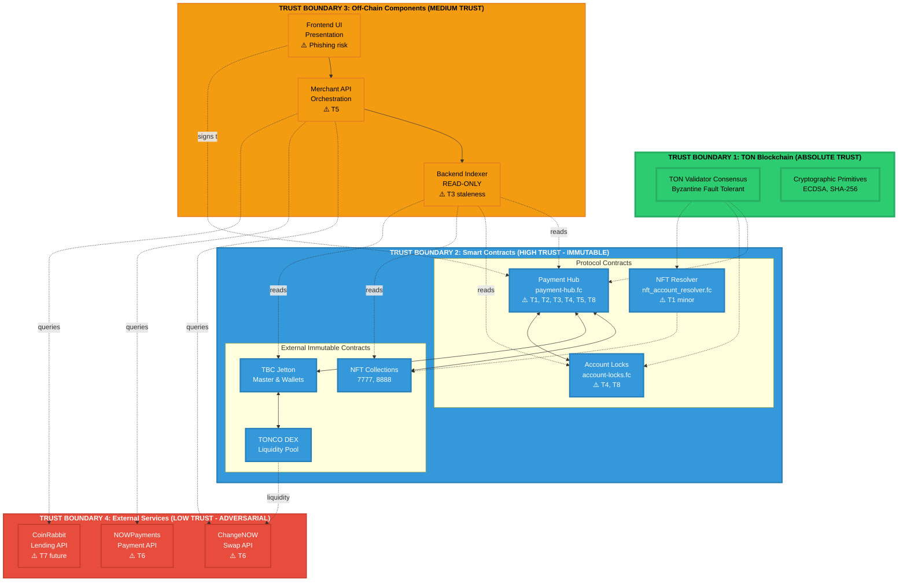
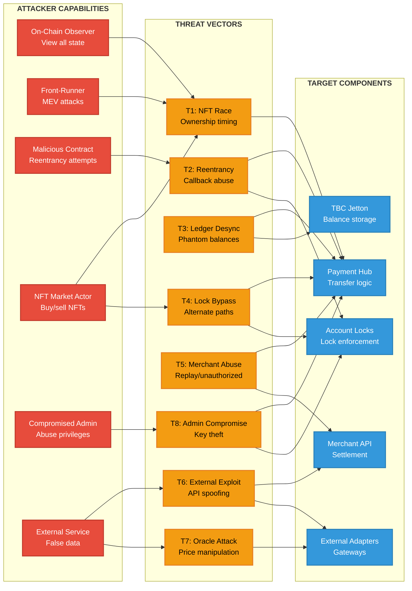
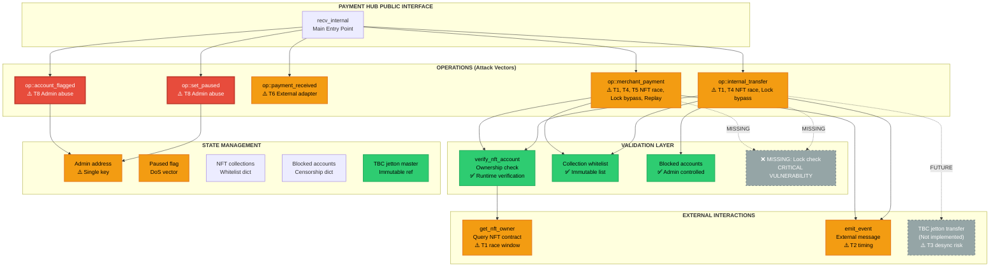
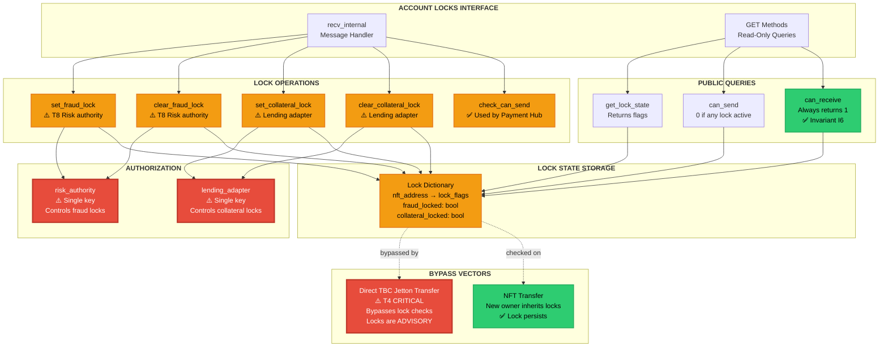
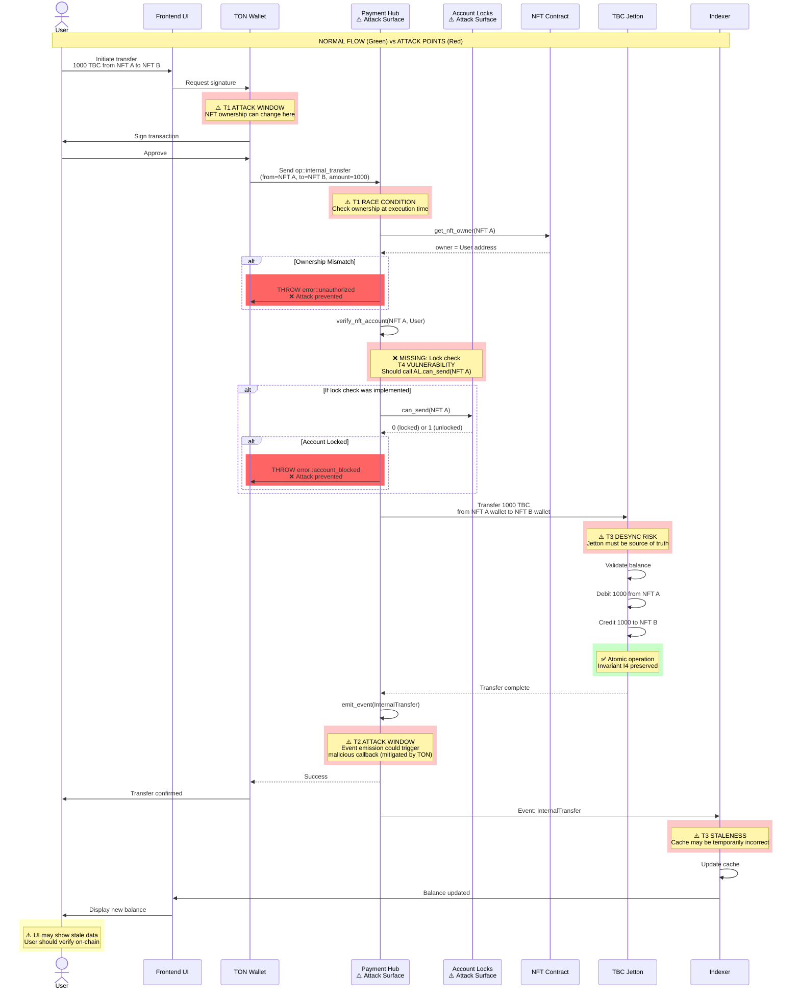
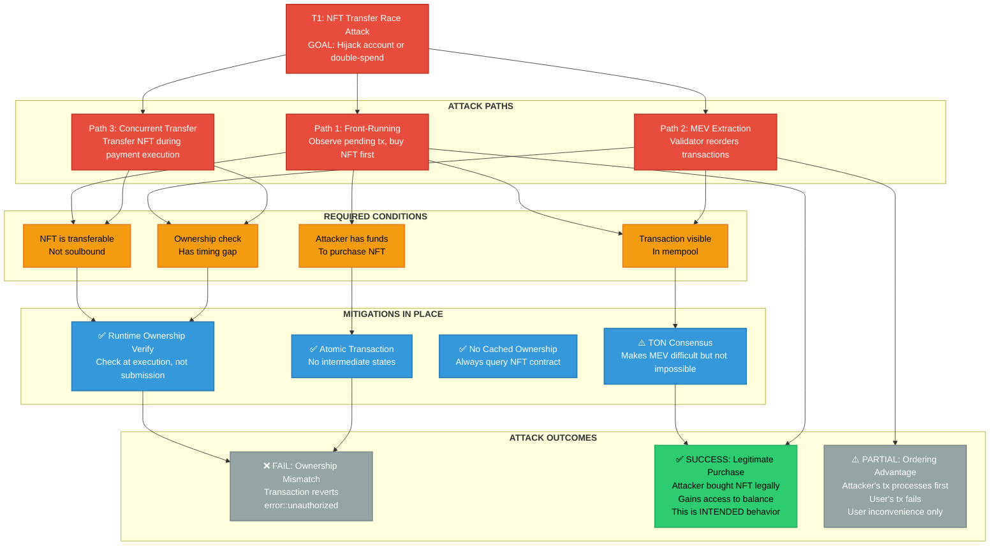
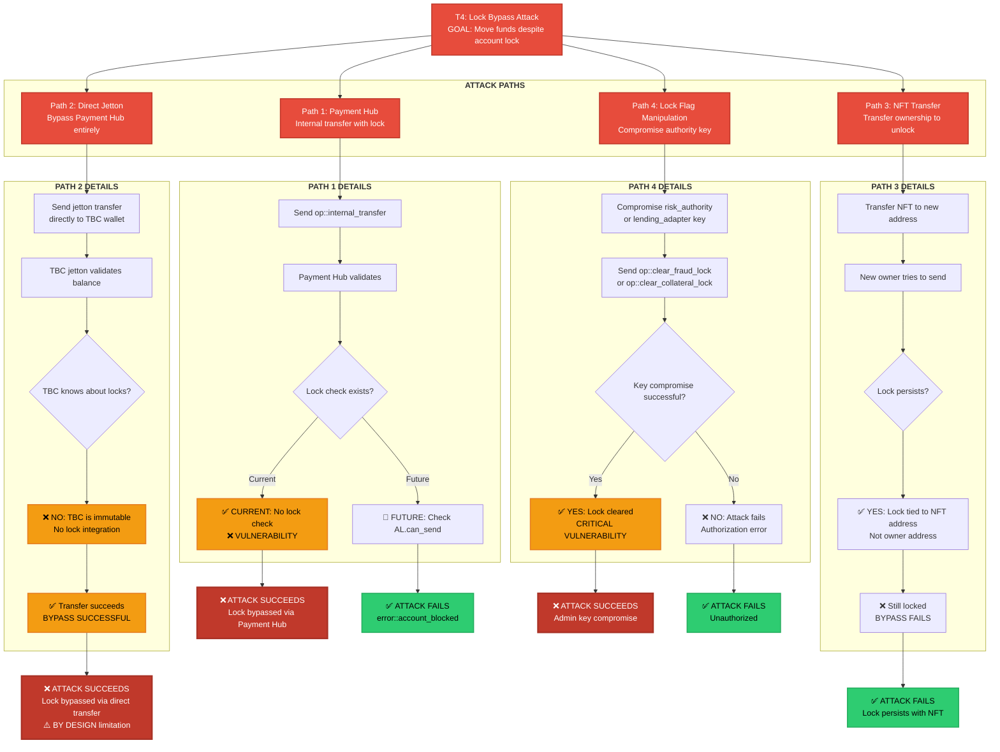
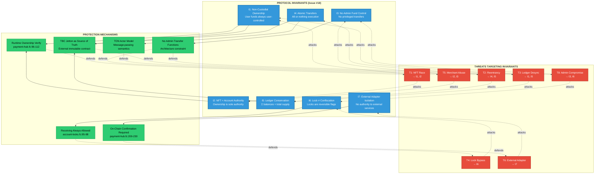

# TONBANKCARD Protocol — Attack Surface Diagrams

**Document Type:** Visual Security Architecture
**Issue Reference:** [#20 - Issue 4.2 Threat Model & Attack Surface Analysis](https://github.com/xlabtg/tonbankcard-protocol/issues/20)
**Companion Document:** [threat-model.md](./threat-model.md)
**Last Updated:** 2025-12-27

---

## Overview

This document provides visual representations of the TONBANKCARD protocol's attack surface, trust boundaries, and threat vectors. These diagrams complement the detailed threat model documentation.

---

## 1. Complete System Architecture with Trust Boundaries



---

## 2. Threat Vector Flow Diagram



---

## 3. Payment Hub Attack Surface Detail



---

## 4. Account Locks Contract Attack Surface



---

## 5. Data Flow: Internal Transfer with Attack Points



---

## 6. Attack Tree: NFT Transfer Race Condition (T1)



---

## 7. Attack Tree: Lock Bypass Attempt (T4)



---

## 8. Threat Severity Matrix

```mermaid
quadrantChart
    title Threat Risk Assessment (Impact vs. Likelihood)
    x-axis Low Likelihood --> High Likelihood
    y-axis Low Impact --> High Impact
    quadrant-1 Critical - Immediate Action
    quadrant-2 High - Plan Mitigation
    quadrant-3 Medium - Monitor
    quadrant-4 Low - Accept Risk

    T8 Admin Compromise: [0.3, 0.95]
    T4 Lock Bypass (Payment Hub): [0.8, 0.85]
    T3 Ledger Desync: [0.2, 0.9]
    T4 Lock Bypass (Direct Jetton): [0.7, 0.7]
    T1 NFT Race (MEV): [0.4, 0.6]
    T5 Merchant Abuse: [0.5, 0.5]
    T6 External Adapter: [0.6, 0.4]
    T2 Reentrancy: [0.2, 0.7]
    T7 Oracle (Future): [0.3, 0.8]
    T1 NFT Race (Front-run): [0.5, 0.3]
```

**Legend:**
- **Quadrant 1 (Top-Right)**: Critical risks requiring immediate action
  - T8: Admin key compromise
  - T4: Lock bypass via Payment Hub (missing check)

- **Quadrant 2 (Top-Left)**: High impact, lower likelihood - plan mitigation
  - T3: Ledger desynchronization
  - T7: Oracle manipulation (future)
  - T2: Reentrancy (low likelihood due to TON)

- **Quadrant 3 (Bottom-Left)**: Medium risk - monitor and document
  - T1: NFT race (front-running)
  - T5: Merchant abuse

- **Quadrant 4 (Bottom-Right)**: Lower impact, higher likelihood - accept or minor fixes
  - T4: Lock bypass via direct jetton (architectural limitation)
  - T6: External adapter exploits
  - T1: NFT race (MEV)

---

## 9. Invariant Protection Map



---

## 10. External Integration Attack Vectors

```mermaid
graph TD
    subgraph USER_FLOW["<b>USER EXTERNAL DEPOSIT FLOW</b>"]
        U1[User: Initiate deposit<br/>1000 USDT → TBC]
        U2[Frontend: Query external APIs]
        U3[ChangeNOW: Generate deposit address]
        U4[User: Send USDT to deposit address]
    end

    subgraph EXTERNAL_PROCESSING["<b>EXTERNAL SERVICE (UNTRUSTED)</b>"]
        E1[ChangeNOW: Receive USDT]
        E2[ChangeNOW: Process swap<br/>⚠️ T6 ATTACK POINT<br/>May lie about completion]
        E3[ChangeNOW: Send TON to DEX]
        E4[DEX: Swap TON → TBC<br/>✅ ON-CHAIN, TRUSTED]
        E5[DEX: Send TBC to user wallet]
    end

    subgraph CONFIRMATION["<b>ON-CHAIN CONFIRMATION (REQUIRED)</b>"]
        C1[TBC Jetton: Transfer event<br/>✅ Blockchain truth]
        C2[Indexer: Detect transfer]
        C3[Merchant API: Verify on-chain]
        C4{On-chain confirmed?}
        C5[✅ Credit user account<br/>Display in UI]
        C6[❌ Do NOT credit<br/>External API was lying]
    end

    subgraph ATTACK_SCENARIOS["<b>ATTACK SCENARIOS</b>"]
        A1[Attack 1: False Confirmation<br/>ChangeNOW says "completed"<br/>but never sent TON]
        A2[Attack 2: MITM<br/>Attacker intercepts API response<br/>returns fake success]
        A3[Attack 3: Webhook Spoof<br/>Attacker sends fake webhook<br/>to merchant API]
    end

    U1 --> U2 --> U3 --> U4
    U4 --> E1 --> E2

    E2 -->|Honest path| E3 --> E4 --> E5
    E5 --> C1 --> C2 --> C3 --> C4

    C4 -->|Yes| C5
    C4 -->|No| C6

    E2 -.Attack 1.-> A1
    U2 -.Attack 2.-> A2
    C3 -.Attack 3.-> A3

    A1 --> C3
    A2 --> C3
    A3 --> C3

    A1 --> C6
    A2 --> C6
    A3 --> C6

    classDef user fill:#3498db,stroke:#2980b9,stroke-width:2px,color:#fff
    classDef external fill:#e74c3c,stroke:#c0392b,stroke-width:2px,color:#fff
    classDef safe fill:#2ecc71,stroke:#27ae60,stroke-width:2px,color:#000
    classDef attack fill:#f39c12,stroke:#e67e22,stroke-width:2px,color:#000

    class U1,U2,U3,U4 user
    class E1,E2,E3 external
    class C1,C2,C3,C4,C5,E4,E5 safe
    class A1,A2,A3,C6 attack
```

---

## Summary

These diagrams provide visual representations of:

1. **Trust Boundaries** - Four-tier trust model from blockchain consensus to external services
2. **Threat Vectors** - Attack paths from capabilities to targets
3. **Attack Surfaces** - Detailed entry points in Payment Hub and Account Locks
4. **Data Flows** - Sequence of operations with attack windows highlighted
5. **Attack Trees** - Detailed paths for NFT race and lock bypass attacks
6. **Risk Matrix** - Threat prioritization based on impact and likelihood
7. **Invariant Protection** - How protocol mechanisms defend core guarantees
8. **External Integration** - Attack vectors in external service integration

For detailed threat descriptions, mitigations, and test cases, see the companion [threat-model.md](./threat-model.md) document.

---

**Document Status**: ✅ Complete
**Rendering**: Use Mermaid-compatible viewers (GitHub, GitLab, Mermaid Live Editor)
**Next Update**: When new contracts deployed or threats identified
