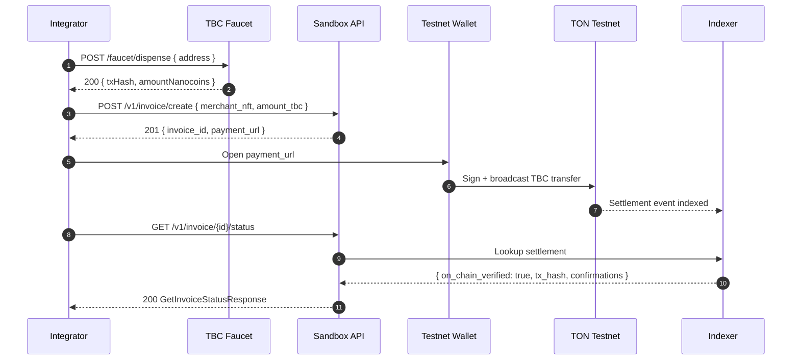

# Tonbankcard Sandbox Environment

> A public testnet playground for integrators. **No real funds, no production
> data, no production SLA.** Reset on a regular cadence.

The sandbox lets merchants and SDK consumers exercise the full Tonbankcard
payment flow — invoice creation → wallet deep link → on-chain settlement →
status verification — against TON **testnet** before they ever touch a real
TBC token.

This document is the canonical reference for the sandbox: how to reach it,
how to obtain test TBC, what limitations apply, and what configuration knobs
exist for self-hosted sandboxes.

Related issues: [#124 C3 Test Sandbox Environment](https://github.com/xlabtg/tonbankcard-protocol/issues/124),
[#118 B2 Mainnet Deployment](https://github.com/xlabtg/tonbankcard-protocol/issues/118),
[#122 C2 SDK Developer Experience](https://github.com/xlabtg/tonbankcard-protocol/issues/122).

---

## 1. Endpoints at a glance

| Service | URL | Purpose |
|---------|-----|---------|
| Merchant API (sandbox) | `https://sandbox.api.tonbankcard.com` | Hosted instance of `api/` in sandbox mode. |
| Payment Indexer | `https://sandbox.api.tonbankcard.com/indexer` | Hosted instance of `backend/indexer/` on testnet. |
| TBC faucet | `https://sandbox.api.tonbankcard.com/faucet` | `scripts/faucet/` — dispenses test TBC. |
| Discovery | `GET /v1/sandbox/info` | Machine-readable sandbox configuration. |

Every sandbox response carries an explicit environment marker:

```
X-Tonbankcard-Environment: sandbox
```

If you do not see this header you are talking to a production deployment —
stop, recheck the base URL, and try again.

> Until the public sandbox host is provisioned, you can run the entire stack
> locally with the recipe in §6. The local stack uses the exact same images
> and middleware as the hosted version.

---

## 2. Quickstart — create your first sandbox invoice

```bash
BASE=https://sandbox.api.tonbankcard.com

# 1. Discover sandbox configuration (default merchant NFT, faucet URL, test cards)
curl -s "$BASE/v1/sandbox/info" | jq

# 2. Create an invoice WITHOUT an API key — sandbox accepts anonymous calls
curl -s -X POST "$BASE/v1/invoice/create" \
  -H 'Content-Type: application/json' \
  -d '{
    "merchant_nft": "EQAAAAAAAAAAAAAAAAAAAAAAAAAAAAAAAAAAAAAAAAAAAAAA",
    "amount_tbc": "1500000000",
    "metadata": { "order_id": "SANDBOX-DEMO-1" }
  }' | jq

# 3. (Optional) Use the documented public sandbox API key explicitly
PUBLIC_KEY=tbck_sandbox_public_anonymous_key
curl -s -X POST "$BASE/v1/invoice/create" \
  -H "Authorization: Bearer $PUBLIC_KEY" \
  -H 'Content-Type: application/json' \
  -d '{ "merchant_nft": "EQAAAAAAAAAAAAAAAAAAAAAAAAAAAAAAAAAAAAAAAAAAAAAA", "amount_tbc": "1500000000" }'
```

The first two calls are equivalent: when the sandbox sees no
`Authorization` header, it transparently injects the public sandbox key
(`tbck_sandbox_public_anonymous_key`). Production deployments do **not** do
this — you must always send a real key there.

> ⚠️ Even sandbox-issued invoices still require an on-chain payment from a
> testnet wallet. Use the faucet (§3) to top up the wallet first.

---

## 3. TBC faucet

### Endpoints

```bash
FAUCET=https://sandbox.api.tonbankcard.com/faucet
ADDR=0:0000000000000000000000000000000000000000000000000000000000000000

# Faucet status — public config
curl -s "$FAUCET/faucet/status" | jq

# Per-address rate-limit window (does not consume a slot)
curl -s "$FAUCET/faucet/status?address=$ADDR" | jq

# Dispense — default 10 TBC, rate-limited to 1 call per address per hour
curl -s -X POST "$FAUCET/faucet/dispense" \
  -H 'Content-Type: application/json' \
  -d "{\"address\": \"$ADDR\"}" | jq
```

### Limits

| Limit | Value | Source |
|-------|-------|--------|
| Dispense window | 1 hour | `FAUCET_RATE_LIMIT_WINDOW_MS` |
| Dispenses per address per window | 1 | `FAUCET_RATE_LIMIT_MAX` |
| Default amount | 10 TBC | `FAUCET_DEFAULT_DISPENSE_NANOCOINS` |
| Hard upper bound per call | 100 TBC | `MAX_DISPENSE_NANOCOINS` |

Exceeding the per-address limit returns `429 Too Many Requests` with a
`Retry-After` header and the `RATE_LIMIT_EXCEEDED` error code. The window is
keyed by the lower-cased address, so changing case to bypass the limit does
not work.

### Error codes

| HTTP | `error.code` | Cause |
|------|--------------|-------|
| 400 | `MISSING_FIELD` | `address` field missing from request body. |
| 400 | `INVALID_ADDRESS` | Address is not a raw `0:hex64` or 48-char base64url form. |
| 422 | `AMOUNT_EXCEEDED` | Requested amount above the hard cap. |
| 429 | `RATE_LIMIT_EXCEEDED` | Address has already used its quota for the window. |
| 500 | `INTERNAL_ERROR` | Dispenser failed; the rate-limit slot is **rolled back** so you can retry safely. |

The faucet implementation lives in [`scripts/faucet/`](../scripts/faucet/) —
see its README for production hardening notes (Redis-backed limits, KMS key
handling, observability).

---

## 4. Test data

### Default merchant NFT

The sandbox is bootstrapped with a published merchant NFT bound to the public
API key:

```
EQAAAAAAAAAAAAAAAAAAAAAAAAAAAAAAAAAAAAAAAAAAAAAA
```

It holds zero real value and is reset on the sandbox cadence (§5). Use it
when you want a one-call demo; create your own merchant NFT once you start
integration testing against scenarios specific to your business logic.

### Test NFT card IDs

```
0:1111111111111111111111111111111111111111111111111111111111111111
0:2222222222222222222222222222222222222222222222222222222222222222
```

These are returned verbatim from `GET /v1/sandbox/info` so SDKs can pick
them up without parsing this document. Both addresses are configured to
accept payments without merchant whitelisting.

### Sandbox API key

```
tbck_sandbox_public_anonymous_key
```

Equivalent to making an unauthenticated call. Documented here so logs are
greppable and so SDKs can pre-fill the value when running in sandbox.

---

## 5. Limitations

- **No production SLA.** The sandbox is best-effort. Expect occasional
  restarts and short outages during deployment of new contract versions.
- **Test data is ephemeral.** Invoices, faucet history, and indexer state
  reset on the cadence reported by `GET /v1/sandbox/info` (default:
  `weekly`). Do not rely on long-lived sandbox state.
- **Testnet only.** The sandbox refuses to start if `TON_NETWORK=mainnet` is
  set — production funds are by construction unreachable from sandbox code
  paths.
- **Rate limits apply.** In addition to the faucet limit, the sandbox API
  enforces the same per-key RPM caps as production
  (100/min create, 1000/min read, 500/min status).
- **No real KYC / fiat gateways.** Payment-gateway adapters
  (ChangeNOW, NOWPayments) are configured in their respective sandbox modes
  and never settle real money.

---

## 6. Self-hosting the sandbox locally

Everything in the hosted sandbox is just `docker-compose.sandbox.yml`. To run
the full stack on your laptop:

```bash
cp .env.sandbox.example .env.sandbox
# Edit .env.sandbox: at minimum set PAYMENT_HUB_ADDRESS / MERCHANT_PAYMENT_HUB_ADDRESS
# to your deployed testnet contracts.

docker compose -f docker-compose.sandbox.yml --env-file .env.sandbox up --build
```

Services come up on these host ports by default:

| Service | URL |
|---------|-----|
| Merchant API (sandbox) | http://localhost:3001 |
| Payment Indexer | http://localhost:3002 |
| TBC faucet | http://localhost:4500 |
| Redis | localhost:6380 |

The compose file shares the exact image build context with the production
`docker-compose.yml`, so the only differences between sandbox and production
are environment variables — there is no separate sandbox fork of the code.

### Sandbox-specific environment variables

| Variable | Default | Purpose |
|----------|---------|---------|
| `TONBANKCARD_SANDBOX` | `true` | Activates sandbox header + anonymous auth + `/v1/sandbox/info`. |
| `NODE_ENV` | `sandbox` | Alternative way to enable sandbox mode (when `TONBANKCARD_SANDBOX` is unset). |
| `SANDBOX_BASE_URL` | `https://sandbox.api.tonbankcard.com` | Surfaced in `/v1/sandbox/info`. |
| `SANDBOX_FAUCET_URL` | `https://sandbox.api.tonbankcard.com/faucet` | Surfaced in `/v1/sandbox/info`. |
| `SANDBOX_DEFAULT_MERCHANT_NFT` | `EQAA…AAA` | Merchant NFT bound to the public sandbox key. |
| `SANDBOX_TEST_NFT_CARDS` | _two synthetic cards_ | Comma-separated NFT card IDs for SDK examples. |
| `SANDBOX_RESET_CADENCE` | `weekly` | Reported by `/v1/sandbox/info` so SDKs can warn users. |
| `FAUCET_DEFAULT_DISPENSE_NANOCOINS` | `10000000000` | Default 10 TBC per call. |
| `FAUCET_RATE_LIMIT_WINDOW_MS` | `3600000` | 1-hour window. |
| `FAUCET_RATE_LIMIT_MAX` | `1` | One dispense per address per window. |
| `SANDBOX_ALLOWED_ORIGINS` | _three SDK example dev servers_ | CORS allow-list for both API and faucet. |

### What sandbox mode changes in the API

1. Every response carries `X-Tonbankcard-Environment: sandbox`.
2. `POST /v1/invoice/create` accepts an empty Authorization header — the
   sandbox injects `Bearer tbck_sandbox_public_anonymous_key` automatically.
3. `GET /v1/sandbox/info` returns the JSON envelope SDKs use for discovery.

All other endpoints behave identically to production — same validation, same
rate limits, same idempotency model. This intentional minimal delta is what
makes sandbox tests meaningful.

---

## 7. End-to-end payment flow



Use the [`@tonbankcard/merchant-sdk`](../sdk/README.md) helpers to drive this
flow programmatically; the SDK examples in [`examples/`](../examples/) all
default to the sandbox.

---

## 8. Security posture

- The sandbox holds **no production credentials**. The sandbox API key
  secret and any faucet signing keys live in sandbox-only KMS keys.
- The faucet never moves real funds: the default `DryRunDispenser` returns
  synthetic transaction hashes, and the real `TonDispenser` (when wired up)
  is connected exclusively to testnet RPC endpoints.
- All sandbox addresses, keys, and contracts are documented openly — there
  are no shared secrets. Treat anything you receive from the sandbox as
  public information.
- The sandbox stack runs behind the same WAF / rate-limit layer as
  production so that abuse cannot cascade into the production environment.

If you suspect the sandbox is misbehaving (handing out real funds, talking
to mainnet, leaking PII), please follow the
[security disclosure process](../SECURITY.md) immediately.

---

## 9. References

- [`scripts/faucet/`](../scripts/faucet/) — faucet implementation + Dockerfile
- [`api/src/middleware/sandbox.ts`](../api/src/middleware/sandbox.ts) — sandbox-mode middleware
- [`docker-compose.sandbox.yml`](../docker-compose.sandbox.yml) — full stack compose file
- [`.env.sandbox.example`](../.env.sandbox.example) — annotated env template
- [Merchant API spec](./merchant-api-spec.md)
- [Merchant API security model](./merchant-api-security.md)
- [`examples/`](../examples/) — React / Vue / vanilla HTML integrations against the sandbox
